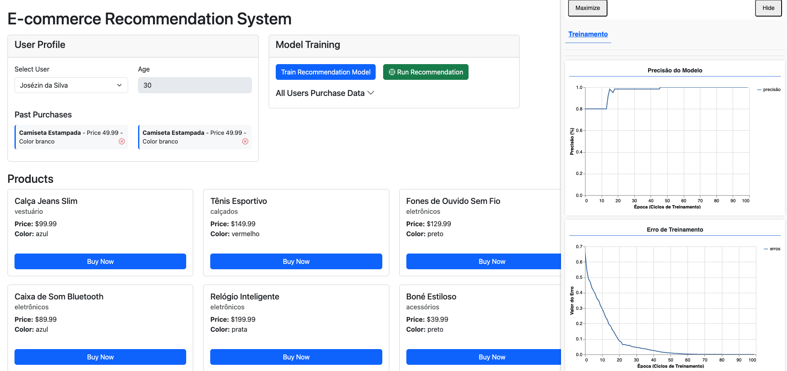

# 02 - Recomendação de E-commerce com TensorFlow.js

Aplicação web de e-commerce que **treina um modelo de recomendação no próprio navegador** com [TensorFlow.js](https://www.tensorflow.org/js), a partir do histórico de compras dos usuários.

## Contexto

Diferente do exemplo `01-tensores` (que roda no Node), aqui o treino e a inferência acontecem **no front-end**, em um Web Worker, para não travar a interface.

Fluxo da aplicação:

1. Carrega usuários e produtos a partir dos JSONs em `data/`.
2. Treina um modelo em um **Web Worker** (`src/workers/modelTrainingWorker.js`) usando os usuários e seu histórico de compras.
3. Permite selecionar um usuário, ver seu perfil e compras passadas, e comprar produtos ("Buy Now"), atualizando o histórico.
4. Usa o modelo treinado para **recomendar produtos** com base na semelhança entre usuários/compras.
5. Visualiza o treino com o **tfjs-vis** (TFVisor), mostrando métricas como loss e accuracy.

A arquitetura segue uma separação simples em camadas:

- `src/view/` — manipulação do DOM e templates (`templates/`)
- `src/controller/` — conecta views e serviços (usuário, produto, treino do modelo, TFVisor, worker)
- `src/service/` — lógica de dados (usuários e produtos)
- `src/workers/` — treino do modelo em background
- `src/events/` — barramento de eventos da aplicação
- `data/` — JSONs de usuários e produtos



## Pré-requisitos

- Node.js 22

## Como rodar

```bash
npm install
npm start
```

O `npm start` sobe um servidor estático com `browser-sync` (live reload). Acesse:

```
http://localhost:3000
```
