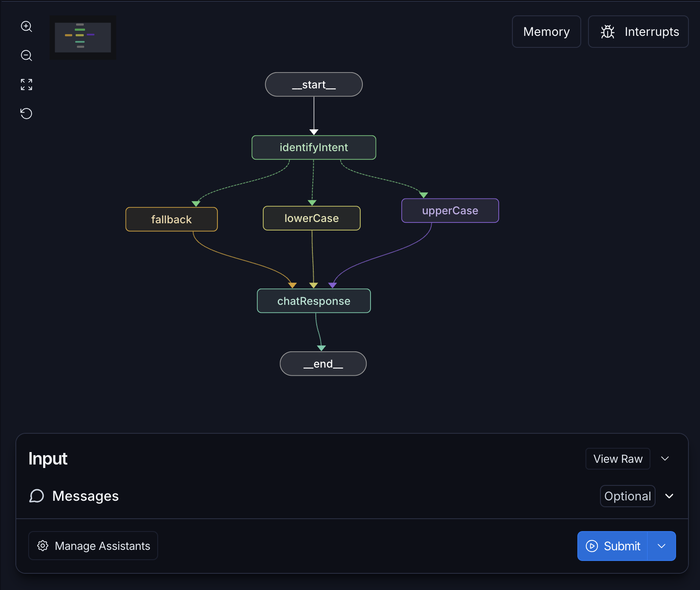
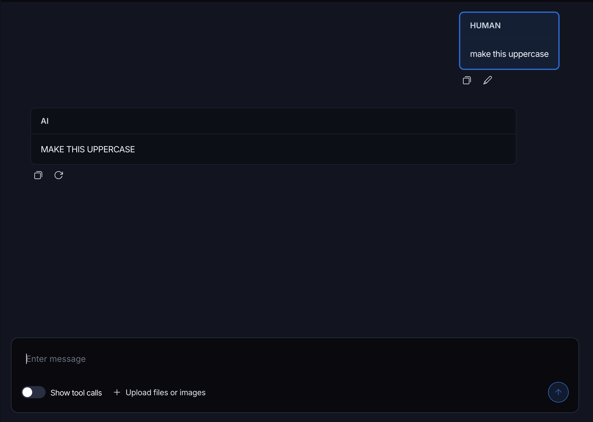

# 02 - LangChain + LangGraph

Um chatbot orquestrado como **grafo de estados** usando [LangGraph](https://langchain-ai.github.io/langgraphjs/) (parte do ecossistema [LangChain](https://js.langchain.com)). O grafo identifica a intenção da mensagem e roteia para o nó certo, mostrando na prática como montar fluxos condicionais entre nós.

## Contexto

Em vez de uma única chamada à LLM, a lógica é modelada como um **`StateGraph`**: um estado compartilhado flui entre nós, e cada nó lê e devolve uma nova versão desse estado. As arestas (`edges`) definem a ordem, e as arestas condicionais (`conditional edges`) decidem o próximo nó com base no estado.

Neste exemplo, o grafo funciona como um mini "interpretador de comandos": a mensagem do usuário é classificada e transformada em `UPPERCASE`, `lowercase`, ou cai num _fallback_ quando o comando é desconhecido.

Fluxo do grafo:



Execução dos comandos no chat:



Conceitos demonstrados:

- **State schema**: o estado (`GraphState`) é definido com [Zod](https://zod.dev) e carrega `messages` (histórico do chat), `output` (texto em processamento) e `command` (intenção detectada).
- **Nós (`nodes`)**: funções puras `(state) => state` — a saída de um nó é a entrada do próximo.
- **Aresta condicional (`addConditionalEdges`)**: roteia a partir do `command` identificado.
- **`messages` do LangChain**: `HumanMessage` (entrada) e `AIMessage` (resposta), o formato padrão de mensagens de chat.

Estrutura principal (`src/`):

- `index.ts` — ponto de entrada; sobe o servidor na porta `3333`
- `server.ts` — servidor [Fastify](https://fastify.dev) com a rota `POST /chat` que invoca o grafo
- `graph/graph.ts` — monta e compila o `StateGraph` (nós, arestas e o schema do estado)
- `graph/factory.ts` — expõe o grafo para o LangGraph CLI/Studio
- `graph/nodes/` — um arquivo por nó:
  - `identify-intent-node.ts` — detecta o comando na mensagem
  - `upper-case-node.ts` / `lower-case-node.ts` — transformam o texto
  - `fallback-node.ts` — resposta padrão para comandos desconhecidos
  - `chat-response-node.ts` — anexa a `AIMessage` final ao histórico

### LangSmith

O ecossistema LangChain inclui o **[LangSmith](https://smith.langchain.com)**, plataforma de observabilidade que registra (`tracing`) cada execução do grafo — passos, entradas/saídas de cada nó e latência — para depurar e avaliar o fluxo. É habilitado pelas variáveis `LANGSMITH_*` do `.env`.

## Pré-requisitos

- Node.js 22 (veja o `.tool-versions` da disciplina) — usa o runner nativo de TypeScript e `--env-file`
- (Opcional) Uma conta no **[LangSmith](https://smith.langchain.com)** para tracing

## Configuração

Copie o `.env.example` para `.env` e preencha (opcional, só para o tracing no LangSmith):

```env
LANGSMITH_API_KEY=your-api-key
LANGSMITH_TRACING_V2=true
LANGSMITH_PROJECT=langchain-example
```

## Como rodar

```bash
npm install

# Sobe o servidor em modo watch (http://localhost:3333)
npm run dev

# Abre o LangGraph Studio para visualizar e depurar o grafo
npm run langgraph:serve

# Roda os testes
npm test
```

Com o servidor no ar, faça uma requisição:

```bash
# Retorna "FAÇA ISSO EM MAIÚSCULO" (uppercase)
curl -X POST http://localhost:3333/chat \
  -H "Content-Type: application/json" \
  -d '{"question": "make this uppercase"}'
```
