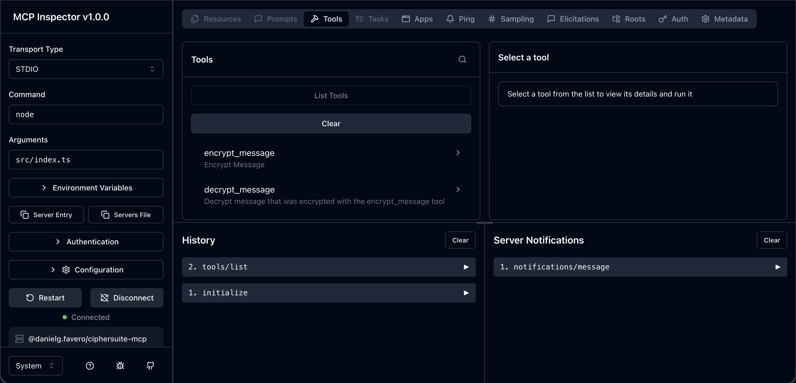

# 04 - API as MCP

Um **servidor MCP que embrulha uma API REST existente** (`@danielg.favero/customers-mcp`): a API de CRUD de clientes continua intacta, e o MCP entra na frente dela como uma camada de **ações** que o agente pode chamar — sem que a API precise saber que existe uma LLM do outro lado.

## Contexto

No [03-mcp-server-from-scratch](../03-mcp-server-from-scratch/) o servidor MCP **era** a regra de negócio (criptografia implementada ali mesmo). Aqui o cenário é o mais comum no mundo real: **já existe um sistema** — uma API REST com banco de dados, possivelmente legada — e o objetivo é expor as operações dela para um agente.

Por isso o projeto tem duas partes independentes:

| Pasta                          | O que é                                                                            |
| ------------------------------ | ---------------------------------------------------------------------------------- |
| [`fastify-api/`](./fastify-api/) | A API "que já existia": CRUD de clientes com Fastify + MongoDB, na porta `9999`   |
| [`mcp-server/`](./mcp-server/)   | O servidor MCP que consome essa API por HTTP e a expõe como tools/resource/prompt |

O MCP **não** substitui a API nem acessa o MongoDB direto: ele fala com ela via `fetch`, como qualquer outro cliente. Isso mantém as validações, os schemas e as regras que já existem na API.

> ⚠️ A conversão **não deve ser um-para-um**. A ideia não é transformar cada endpoint em uma tool, e sim expor **ações** que fazem sentido para o usuário — cada ação pode chamar quantos endpoints precisar. Neste projeto o CRUD acaba ficando bem próximo de 1:1 (é o exemplo didático), mas a tool `get_customer` mostra a ideia: ela aceita `_id`, `name` ou `phone` e decide sozinha entre `GET /customers/:id` e `GET /customers` + filtro em memória. Para o agente é **uma** ação ("achar cliente"), não dois endpoints.

## O que o servidor MCP expõe

| Tipo        | Nome                    | Descrição                                                              | Endpoints usados                            |
| ----------- | ----------------------- | ---------------------------------------------------------------------- | ------------------------------------------- |
| 🔧 Tool     | `list_customers`        | Lista todos os clientes                                                | `GET /customers`                            |
| 🔧 Tool     | `create_customer`       | Cria um cliente (`name`, `phone`)                                      | `POST /customers`                           |
| 🔧 Tool     | `get_customer`          | Busca um cliente por qualquer combinação de `_id`, `name` e `phone`     | `GET /customers/:id` **ou** `GET /customers` |
| 🔧 Tool     | `update_customer`       | Atualiza `name` e/ou `phone` de um cliente pelo `_id`                  | `PUT /customers/:id`                        |
| 🔧 Tool     | `delete_customer`       | Remove um cliente pelo `_id`                                           | `DELETE /customers/:id`                     |
| 📄 Resource | `customers://api-info`  | Descreve a API embrulhada: base URL, endpoints e formato do `Customer`  | —                                           |
| 💬 Prompt   | `find_customer_prompt`  | Template que pede ao agente para achar um cliente com os dados que tem | —                                           |

O **resource** existe justamente porque a API é externa: ele dá ao cliente MCP um "mapa" do sistema embrulhado (base URL, endpoints, shape do recurso), útil quando o agente precisa entender o domínio antes de escolher a tool.

## Estrutura

```
fastify-api/                      # A API existente (Fastify + MongoDB)
  src/index.js                    # Rotas /v1/customers (CRUD) + /v1/health
  src/db.js, src/config.js        # Conexão e configuração do MongoDB
  config/seed.js, config/users.js # Seed de clientes para desenvolvimento/teste
  test/api.test.js                # Testes da API com o test runner do Node
  docker-compose.yml              # MongoDB (e a própria API, opcionalmente)

mcp-server/                       # O servidor MCP
  src/index.ts                    # Entrypoint — StdioServerTransport
  src/mcp/
    server.ts                     # Monta o McpServer e registra tudo
    tools/                        # Uma tool por arquivo (register*Tool)
    resources/apiInfo.ts          # customers://api-info
    prompts/findCustomer.ts       # find_customer_prompt
  src/application/customerService.ts       # Ações do domínio (orquestra o client)
  src/infrastructure/customerHttpClient.ts # fetch na API REST
  src/domain/customer.ts          # Schemas Zod + tipos do Customer
  tests/                          # Testes de integração via protocolo MCP
  .vscode/mcp.json                # Registro do servidor para o VS Code
```

### Por que quatro camadas

O [03](../03-mcp-server-from-scratch/) separava só `service.ts` (regra) de `mcp.ts` (casca). Quando o MCP embrulha um sistema externo, vale uma camada a mais:

- **`domain/`** — os schemas Zod (`CustomerSchema`, `CustomerSearchSchema`, …) e os tipos derivados deles. É a única definição do formato de um cliente, reaproveitada como `inputSchema`/`outputSchema` das tools, `argsSchema` do prompt e tipagem do HTTP client.
- **`infrastructure/`** — `CustomerHttpClient`, o único lugar que sabe que a API é HTTP, que a base URL é aquela e que `PUT` recebe o body sem `_id`.
- **`application/`** — `CustomerService`, onde vive a lógica de **ação**: `findCustomer` decide se busca por id ou lista e filtra. É aqui que uma ação combinaria vários endpoints.
- **`mcp/`** — só tradução: recebe os argumentos do modelo, chama o service, devolve `content` + `structuredContent`. Nenhuma regra de negócio.

Na prática: trocar a API REST por gRPC mexeria só em `infrastructure/`, e adicionar uma ação composta mexeria só em `application/` + um arquivo novo em `mcp/tools/`.

### Detalhes de implementação

- **`outputSchema` em todas as tools**, com `structuredContent` no retorno — o cliente consome a resposta tipada em vez de fazer parse do texto. As mutações compartilham `CustomerMutationSchema` (`{ message, id }`), que é exatamente o que a API já devolve.
- **Erros não são exceções**: cada tool tem um `try/catch` que devolve `{ isError: true, content: [...] }` com a mensagem do erro. O agente lê a falha como contexto e pode se corrigir (ex.: pedir o `_id` correto) em vez de quebrar a chamada.
- **`import { z } from "zod/v3"`** — o SDK ainda espera schemas Zod v3; o `zod@3.25+` expõe esse subpath explicitamente.
- **Logs em `stderr`** (`console.error` no `src/index.ts`): no transporte `stdio` o **stdout é o canal do protocolo**, então qualquer `console.log` entraria no meio do JSON-RPC.
- **A base URL está fixa** em `src/mcp/server.ts` (`http://localhost:9999/v1`). Para outro ambiente, é o ponto a parametrizar (variável de ambiente).
- **`PUT /customers/:id` responde 404 quando nada muda** (`modifiedCount === 0`), inclusive ao reenviar os mesmos valores. Uma peculiaridade da API que o agente herda — o tipo de coisa que, num sistema legado, vale esconder atrás da ação em vez de repassar crua.

## Pré-requisitos

- **Node.js 24+** — roda TypeScript nativamente, sem build step
- **Docker + Docker Compose** — para o MongoDB da API

## Como rodar

São dois processos. Primeiro a API:

```bash
cd fastify-api
npm ci

docker compose up -d mongodb     # Sobe só o MongoDB
node config/seed.js              # Opcional: popula alguns clientes
npm start                        # API em http://localhost:9999
```

Confira com `curl http://localhost:9999/v1/health` — deve responder `{"app":"customers","version":"v1.0.1"}`.

Depois o servidor MCP:

```bash
cd mcp-server
npm install
npm start                        # Normalmente é o cliente MCP que roda isso, não você
```

Não existe passo de build em nenhum dos dois. (Em Node < 22.18 o MCP precisa da flag `--experimental-strip-types`, que é a usada em `tests/helpers.ts` e no `.vscode/mcp.json` por compatibilidade.)

## MCP Inspector

Com a API rodando, o [Inspector](https://modelcontextprotocol.io/docs/tools/inspector) é a forma mais rápida de validar tudo — ele sobe o servidor, faz o handshake e permite listar/chamar tools, resources e prompts numa UI de browser, sem gastar chamada de LLM:

```bash
cd mcp-server
npm run mcp:inspect
```



## Usando no VS Code

O `mcp-server/.vscode/mcp.json` já registra o servidor:

```json
{
  "servers": {
    "customers-mcp": {
      "command": "node",
      "args": ["--experimental-strip-types", "./src/index.ts"]
    }
  }
}
```

O caminho é **relativo à raiz do workspace** — funciona ao abrir a pasta `mcp-server/` diretamente. Se o workspace for a raiz do monorepo, troque por um caminho absoluto até `src/index.ts`.

Recarregue a janela (`Cmd+Shift+P` → **Developer: Reload Window**) e, com a API no ar, peça no Copilot Chat em modo agente:

```
Liste todos os clientes cadastrados
```

```
Cadastre o cliente Maria Silva com o telefone (11) 98888-7777
```

```
Ache o cliente chamado Maria e troque o telefone dele para (11) 97777-6666
```

```
Mostre o resource customers://api-info
```

O último pedido é o que evidencia a diferença em relação a chamar a API na mão: o agente encadeia `get_customer` → `update_customer` sozinho, porque a primeira tool devolve o `_id` que a segunda exige.

## Testes

Os dois projetos têm suíte própria, ambas com o test runner nativo do Node.

**API** (não precisa da API no ar, sobe o Fastify em memória com `inject`; precisa do MongoDB):

```bash
cd fastify-api
docker compose up -d mongodb
npm test                         # Com relatório de cobertura
```

**Servidor MCP** (precisa da **API rodando** em `localhost:9999`):

```bash
cd mcp-server
npm test
npm run test:dev                 # Watch mode + inspector do Node
```

Os testes do MCP são de **integração pelo protocolo**, não unitários: `tests/helpers.ts` sobe o servidor como processo filho via `StdioClientTransport` e devolve um `Client` do próprio SDK — ou seja, exercitam o mesmo caminho que um agente faria, e de quebra a API real por baixo.

Cobertura atual:

- `tests/tools/customers.test.ts` — o CRUD completo (listar, criar, buscar por nome, atualizar, deletar)
- `tests/resources/apiInfo.test.ts` — o resource aparece no `listResources` com a descrição certa
- `tests/prompt/findCustomer.test.ts` — o prompt renderizado cita a tool `get_customer` e os parâmetros da busca

> ⚠️ Os testes gravam no **mesmo banco** que a API está usando (`DB_NAME=customers`) e não limpam o que criam — cada rodada deixa clientes "Teste" para trás. Rode `node config/seed.js` para zerar a coleção quando incomodar.

## Scripts

**`mcp-server/`**

| Script                | Descrição                                              |
| --------------------- | ------------------------------------------------------ |
| `npm start`           | Sobe o servidor (é o comando usado pelos clientes MCP) |
| `npm run dev`         | Sobe com `--watch` e inspector do Node                 |
| `npm test`            | Testes de integração via protocolo MCP                 |
| `npm run test:dev`    | Testes em watch mode com inspector                     |
| `npm run mcp:inspect` | Abre a UI do MCP Inspector                             |

**`fastify-api/`**

| Script                        | Descrição                                    |
| ----------------------------- | -------------------------------------------- |
| `npm start`                   | Sobe a API em `:9999` com `DB_NAME=customers` |
| `npm run dev`                 | Sobe com `--watch`                           |
| `npm test`                    | Testes da API com cobertura                  |
| `npm run docker:infra:up`     | Sobe **todos** os serviços do Compose — MongoDB **e** a API em container (ocupa a `:9999`) |
| `npm run docker:infra:down`   | Derruba os containers                        |
| `npm run docker:infra:cleanup`| Derruba tudo e apaga volumes                 |
| `npm run docker:infra:logs`   | Acompanha os logs dos containers             |
