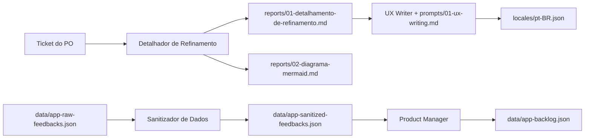

# Pix Agendado — Discovery & Refinement com LLMs

Pipeline de **Discovery & Refinement** para a feature de *Pix Agendado* de um app bancário, conduzido por agentes de LLM especializados. A partir de um ticket curto do PO e de feedbacks brutos de usuários, o projeto gera artefatos prontos para o time de engenharia e design:

- refinamento técnico com riscos, edge cases e estados de UI;
- diagrama de fluxo em Mermaid.js;
- catálogo de mensagens de sistema (i18n) padronizado por UX Writing;
- dataset de feedbacks anonimizado conforme a LGPD;
- backlog priorizado de bugs, melhorias de UX e novas features.

Cada etapa é um agente com *system prompt* próprio, definido em `.claude/agents/`. Os prompts são texto puro e podem ser usados em qualquer LLM (Claude, Gemini, GPT etc.).

## Entrada: o ticket do PO

```md
# Ticket: Novo Fluxo de Transferência Pix Agendado

Precisamos criar uma tela onde o usuário possa agendar um Pix. Ele deve escolher o contato,
colocar o valor, selecionar a data e confirmar. Se der sucesso, mostra a tela de comprovante.

Regras:
- O limite diário é R$ 5.000,00.
- Não pode agendar para o mesmo dia (se for hoje, é Pix normal).
- Tem que ter um botão para cancelar o agendamento depois.
```

## Arquitetura do pipeline



### 1. Refinamento de requisitos

| Item    | Arquivo                                       |
| ------- | --------------------------------------------- |
| Agente  | `.claude/agents/detalhador-de-refinamento.md` |
| Entrada | Ticket do PO (acima)                          |
| Saída   | `reports/01-detalhamento-de-refinamento.md`   |

Persona de Arquiteto de Software + Especialista em UX. A saída segue quatro seções fixas:

- `analise_de_risco`: pontos cegos (autenticação, idempotência, fuso horário, saldo na data de execução etc.);
- `mapeamento_de_estados`: estados de UI de loading, empty, erro, confirmação e cancelamento;
- `cenarios_ocultos`: *unhappy paths* que não estavam no ticket;
- `regras_de_negocio_conflitantes`: regras inseguras ou contraditórias, mais as perguntas bloqueantes para o PO.

### 2. Diagrama de fluxo

| Item  | Arquivo                       |
| ----- | ----------------------------- |
| Saída | `reports/02-diagrama-mermaid.md` |

O refinamento vira um `graph TD` em Mermaid.js, cobrindo desde o carregamento de contatos até o agendamento, a execução e o cancelamento, com cada ramo de erro mapeado. Ele é renderizado nativamente no GitHub.

### 3. UX Writing / i18n

| Item    | Arquivo                                            |
| ------- | -------------------------------------------------- |
| Agente  | `.claude/agents/ux-writer.md`                      |
| Prompt  | `prompts/01-ux-writing.md`                         |
| Saída   | `locales/pt-BR.json` (45 chaves)                   |

O agente extrai do refinamento todos os cenários de erro, validação, exceção e sucesso e gera uma mensagem para cada um. Regras do style guide:

- **Sem culpa:** "Não foi possível processar" em vez de "Dado inválido";
- **Resolutivo:** toda mensagem aponta o próximo passo, sem becos sem saída;
- **Terminologia fixa:** *Transferência*, *Agendamento*, *Chave Pix*;
- **Limites:** `title` com até 40 caracteres e `message` com até 140.

```json
"AMOUNT_EXCEEDS_DAILY_LIMIT": {
  "title": "Valor acima do limite diário",
  "message": "Para {date}, ainda é possível agendar até {remaining_limit}. Ajuste o valor ou escolha outra data.",
  "action_label": "Ajustar valor"
}
```

Os placeholders (`{date}`, `{remaining_limit}`, `{balance}` etc.) são interpolados pelo front-end.

### 4. Sanitização de feedbacks (LGPD)

| Item    | Arquivo                               |
| ------- | ------------------------------------- |
| Agente  | `.claude/agents/sanitizador-de-dados.md` |
| Entrada | `data/app-raw-feedbacks.json`         |
| Saída   | `data/app-sanitized-feedbacks.json`   |

- **Anonimização:** CPF, e-mail, telefone e nomes de terceiros viram `[REDACTED]`, e o `author` vira um ID anônimo (`user_1`, `user_2` etc.).
- **Remoção de ruído:** saem auto-replies de bot, tickets de teste e reclamações de atendimento presencial sem relação com o software.
- **Contexto técnico preservado:** modelo do aparelho, fluxo e sintoma continuam intactos.

Resultado: dos 6 registros brutos, sobram 3 úteis.

### 5. Priorização de backlog

| Item    | Arquivo                               |
| ------- | ------------------------------------- |
| Agente  | `.claude/agents/product-manager.md`   |
| Entrada | `data/app-sanitized-feedbacks.json`   |
| Saída   | `data/app-backlog.json`               |

Cada feedback vira um ticket com `category` (`BUG_CRITICO`, `UX_UI_IMPROVEMENT` ou `NEW_FEATURE`), `severity` (`ALTA`, `MEDIA` ou `BAIXA`; crash e tela branca são sempre `ALTA`), `user_pain` e `proposed_action`.

| Ticket  | Categoria           | Severidade | Dor                                                     |
| ------- | ------------------- | ---------- | ------------------------------------------------------- |
| TKT-101 | `BUG_CRITICO`       | `ALTA`     | Tela branca durante o Pix                               |
| TKT-102 | `BUG_CRITICO`       | `ALTA`     | Crash ao agendar para o dia 31 em mês de 30 dias        |
| TKT-103 | `UX_UI_IMPROVEMENT` | `MEDIA`    | Comprovante escondido, a 3 cliques de distância          |

## Estrutura

```
01-pix-agendado/
├── .claude/agents/
│   ├── detalhador-de-refinamento.md   # refinamento técnico + estados de UI
│   ├── ux-writer.md                   # style guide de mensagens (JSON)
│   ├── sanitizador-de-dados.md        # anonimização LGPD + limpeza
│   ├── product-manager.md             # classificação e priorização
│   └── readme-writer.md               # geração de documentação
├── prompts/
│   └── 01-ux-writing.md               # prompt de tarefa para o UX Writer
├── reports/
│   ├── 01-detalhamento-de-refinamento.md
│   └── 02-diagrama-mermaid.md
├── locales/
│   └── pt-BR.json
└── data/
    ├── app-raw-feedbacks.json
    ├── app-sanitized-feedbacks.json
    └── app-backlog.json
```

## Como utilizar

### Com Claude Code

Os agentes em `.claude/agents/` são carregados automaticamente como subagentes quando o Claude Code roda neste diretório:

```bash
cd aulas/disciplinas/05-ferramentas-de-ia-para-ux-ui/01-pix-agendado
claude
```

```
> Use o agente Sanitizador de Dados em data/app-raw-feedbacks.json e salve em data/app-sanitized-feedbacks.json
> Use o agente Product Manager em data/app-sanitized-feedbacks.json e salve em data/app-backlog.json
```

### Com outro LLM (Gemini, ChatGPT etc.)

1. Copie o corpo do agente (sem o frontmatter YAML) para o campo de *System Instructions*.
2. Envie a entrada da etapa como mensagem do usuário: o ticket, o JSON de feedbacks ou o prompt de `prompts/`.
3. Para as etapas que retornam JSON, ative o modo de saída estruturada (JSON mode) quando o provedor oferecer.
4. Siga a ordem do pipeline. O UX Writer depende do refinamento estar no histórico da conversa.

## Stack

- **Engenharia de Prompt:** personas, regras explícitas e schema de saída fixo por agente
- **Claude Code Subagents:** orquestração local dos agentes
- **Markdown:** relatórios de refinamento
- **JSON:** mensagens i18n, datasets e backlog
- **Mermaid.js:** diagramas de fluxo versionados como código
- **Data Sanitization (LGPD):** anonimização de PII antes da análise
