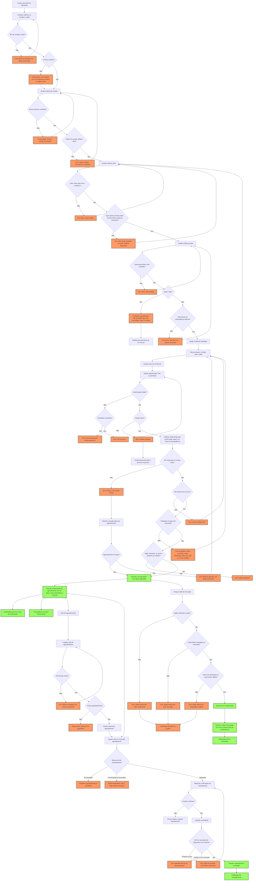

```mermaid
graph TD
    A[Usuário abre tela Pix Agendado] --> B[Loading: skeleton de contatos e saldo]
    B --> C{API de contatos online?}
    C -- Não --> C1[Erro: falha ao carregar com Tentar novamente]
    C1 --> B
    C -- Sim --> D{Possui contatos?}
    D -- Não --> D1[Empty State: sem contatos com CTA Adicionar contato ou digitar chave]
    D1 --> E
    D -- Sim --> E[Usuário seleciona contato]

    E --> E1{Busca retornou resultado?}
    E1 -- Não --> E2[Empty State: nenhum contato encontrado]
    E2 --> E
    E1 -- Sim --> F{Chave do contato válida e ativa?}
    F -- Não --> F1[Erro: chave inválida, inexistente ou migrada]
    F1 --> E
    F -- Sim --> G[Usuário informa valor]

    G --> H{Valor maior que zero e numérico?}
    H -- Não --> H1[Erro inline: valor inválido]
    H1 --> G
    H -- Sim --> I{Valor dentro do limite diário de R$ 5.000 na data de execução?}
    I -- Não --> I1[Erro inline: limite excedido e mostra restante disponível]
    I1 --> G
    I -- Sim --> J[Usuário seleciona data]

    J --> K{Data preenchida e não passada?}
    K -- Não --> K1[Erro inline: data inválida]
    K1 --> J
    K -- Sim --> L{Data é hoje?}
    L -- Sim --> L1[Feedback: agendamento não permitido para hoje com atalho Fazer Pix agora]
    L1 --> L2[Redireciona para fluxo de Pix normal]
    L -- Não --> M{Data dentro da antecedência máxima?}
    M -- Não --> M1[Erro inline: data além do máximo permitido]
    M1 --> J
    M -- Sim --> N[Botão Confirmar habilitado]

    N --> O[Tela de resumo: contato, valor e data]
    O --> P[Usuário clica em Confirmar]
    P --> Q[Solicita autenticação: PIN ou biometria]
    Q --> R{Autenticação válida?}
    R -- Não --> R1{Tentativas excedidas?}
    R1 -- Não --> R2[Erro: PIN incorreto]
    R2 --> Q
    R1 -- Sim --> R3[Erro: acesso bloqueado temporariamente]
    R -- Sim --> S{Sessão ativa?}
    S -- Não --> S1[Erro: sessão expirada]
    S1 --> S2[Redireciona para login e preserva rascunho]
    S -- Sim --> T[Loading: botão bloqueado contra duplo clique com chave de idempotência]

    T --> U{API respondeu no tempo limite?}
    U -- Não --> U1[Erro: timeout com estado incerto]
    U1 --> U2[Sistema consulta status do agendamento]
    U2 --> U3{Agendamento foi criado?}
    U3 -- Sim --> Z
    U3 -- Não --> U4[Erro: falha ao agendar com Tentar novamente]
    U4 --> O
    U -- Sim --> V{API online sem erro 5xx?}
    V -- Não --> V1[Erro: serviço indisponível]
    V1 --> O
    V -- Sim --> W{Validação no back-end aprovada?}
    W -- Não --> W1[Erro de negócio: limite excedido, conta bloqueada, data virou hoje ou chave inválida]
    W1 --> O
    W -- Sim --> X{Saldo suficiente, se houver bloqueio na criação?}
    X -- Não --> X1[Erro: saldo insuficiente]
    X1 --> G
    X -- Sim --> Z[Sucesso: Pix agendado com status Agendado]

    Z --> Z1[Tela de Comprovante de agendamento com ID, datas, valor, destinatário e Cancelar]
    Z1 --> Z2[Notificação push ou e-mail de confirmação]
    Z1 --> Z3[Compartilhar ou baixar comprovante]
    Z1 --> AA[Lista de agendamentos]

    AA --> AB[Loading: lista de agendamentos]
    AB --> AC{API da lista online?}
    AC -- Não --> AC1[Erro: falha ao carregar com Tentar novamente]
    AC1 --> AB
    AC -- Sim --> AD{Possui agendamentos?}
    AD -- Não --> AD1[Empty State: Nenhum Pix agendado]
    AD -- Sim --> AE[Usuário seleciona agendamento]

    Z1 --> AF
    AE --> AF[Usuário clica em Cancelar agendamento]
    AF --> AG{Status permite cancelamento?}
    AG -- Já cancelado --> AG1[Feedback: agendamento já cancelado]
    AG -- Processando ou executado --> AG2[Botão desabilitado: não é mais possível cancelar]
    AG -- Agendado --> AH[Modal de confirmação de cancelamento]
    AH --> AI{Usuário confirma?}
    AI -- Não --> AI1[Fecha modal e mantém agendamento]
    AI -- Sim --> AJ[Loading: cancelando]
    AJ --> AK{API de cancelamento respondeu com sucesso?}
    AK -- Timeout ou erro --> AK1[Erro: falha ao cancelar com Tentar novamente]
    AK1 --> AH
    AK -- Conflito: já em execução --> AK2[Erro: agendamento já em processamento]
    AK -- Sim --> AL[Sucesso: agendamento cancelado]
    AL --> AM[Notificação de cancelamento]

    Z --> AN[Chega a data de execução]
    AN --> AO{Saldo suficiente na data?}
    AO -- Não --> AO1[Erro: status Falhou por saldo insuficiente]
    AO1 --> AO2[Notificação de falha ao usuário]
    AO -- Sim --> AP{Limite diário respeitado na execução?}
    AP -- Não --> AP1[Erro: status Falhou por limite excedido]
    AP1 --> AO2
    AP -- Sim --> AQ{Chave do destinatário e conta ainda válidas?}
    AQ -- Não --> AQ1[Erro: status Falhou por destinatário inválido]
    AQ1 --> AO2
    AQ -- Sim --> AR[Executa Pix e debita valor]
    AR --> AS[Sucesso: status Executado com novo comprovante de transferência]
    AS --> AT[Notificação de Pix executado]

    classDef error fill:#f96,stroke:#333,stroke-width:2px;
    classDef success fill:#9f6,stroke:#333,stroke-width:2px;

    class C1,D1,E2,F1,H1,I1,K1,L1,M1,R2,R3,S1,U1,U4,V1,W1,X1,AC1,AD1,AG1,AG2,AK1,AK2,AO1,AO2,AP1,AQ1 error;
    class Z,Z1,Z2,Z3,AL,AM,AR,AS,AT success;
```

```

```
