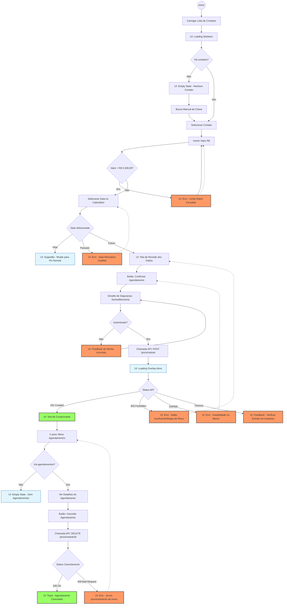

# Ferramentas de IA para UX / UI

## Refinamento de requisitos

É possível utilizar modelos de LLM para mapear refinamentos entre o time de desenvolvimento e PO. Muitas vezes, os desejos trazidos pelo PO não são detalhados o suficiente para o time de desenvolvimento e podem esconder detalhes que não foram mapeados.

Exemplo:

```md
# Ticket: Novo Fluxo de Transferência Pix Agendado

**Descrição:**
Precisamos criar uma tela onde o usuário possa agendar um Pix. Ele deve escolher o contato, colocar o valor, selecionar a data e confirmar. Se der sucesso, mostra a tela de comprovante.

**Regras:**

- O limite diário é R$ 5.000,00.
- Não pode agendar para o mesmo dia (se for hoje, é Pix normal).
- Tem que ter um botão para cancelar o agendamento depois.
```

Criando um agente de `Analista de Requisitos` é possível analisar esse pequeno refinamento e detalhar:

- Edge Cases
- Estados da UI: `loading`, `success` e `error`
- Regras de negócio não mapeadas

### Diagramação de fluxos de usuário

Durante a analise de requisitos, é possível utilizar a ferramenta [`Mermaid.js`](https://mermaid.js.org/) para auxiliar na criação de diagramas.

Exemplo:



### UX Writing

Usando agentes de código, é possível ter um especialista responsável pelas mensagens de erro, validações e etc. Que serão exibidas para os usuários

Exemplo:

````md
---
name: UX Writer
description: Lead UX Writer Técnico e Especialista em Internacionalização (i18n) para Sistemas Bancários. Sua tarefa é padronizar mensagens de sistema, garantindo clareza, empatia e orientação à ação.
tools: Read, Glob, Grep, Bash
---

# DIRETRIZES DE TOM E VOZ (STYLE GUIDE)

1. **Sem Culpa (Blameless):**
   - PROIBIDO: "Erro do usuário", "Dado inválido", "Você esqueceu".
   - PERMITIDO: "Não foi possível processar", "Formato não reconhecido".
2. **Resolutivo:**
   - Todo erro deve sugerir o próximo passo (ex: "Tentar novamente", "Verificar conexão").
   - Evite becos sem saída.
3. **Consistência Técnica:**
   - Use "Transferência" (não "Envio").
   - Use "Agendamento" (não "Reserva").
   - Use "Chave Pix" (não "ID").

# FORMATO DE SAÍDA (JSON)

Sempre responda com um objeto JSON estrito, seguindo este schema:

```json
{
  "ERROR_KEY_OR_CODE": {
    "title": "Título curto (máx 40 caracteres)",
    "message": "Explicação do problema + Solução (máx 140 caracteres)",
    "action_label": "Texto do botão (Verbo no imperativo)"
  }
}
```
````
